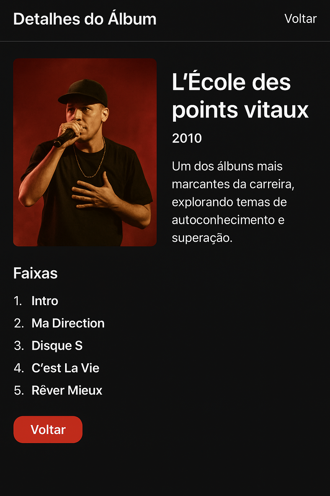

[](https://classroom.github.com/a/KZhXwLZL)
[](https://classroom.github.com/open-in-codespaces?assignment_repo_id=20650000)
# Trabalho Prático 05 - Semanas 7 e 8

**Páginas de detalhes dinâmicas**

Nessa etapa, vamos evoluir o trabalho anterior, acrescentando a página de detalhes, conforme o  projeto escolhido. Imagine que a página principal (home-page) mostre um visão dos vários itens que existem no seu site. Ao clicar em um item, você é direcionado pra a página de detalhes. A página de detalhe vai mostrar todas as informações sobre o item do seu projeto. seja esse item uma notícia, filme, receita, lugar turístico ou evento.

Leia o enunciado completo no Canvas. 

**IMPORTANTE:** Assim como informado anteriormente, capriche na etapa pois você vai precisar dessa parte para as próximas semanas. 

**IMPORTANTE:** Você deve trabalhar e alterar apenas arquivos dentro da pasta **`public`,** mantendo os arquivos **`index.html`**, **`styles.css`** e **`app.js`** com estes nomes, conforme enunciado. Deixe todos os demais arquivos e pastas desse repositório inalterados. **PRESTE MUITA ATENÇÃO NISSO.**

## Informações Gerais

- Nome: Pedro Enzo Campos Fiel
- Matricula: 903847
# Projeto: Carreira do rapper Veigh  

- **Proposta de projeto escolhida:** Carreira do rapper Veigh  
- **Breve descrição sobre seu projeto:** Nesse projeto irei falar sobre a carreira, jornada, músicas, álbuns e projetos do presente e do futuro do artista Veigh.

---

## 📸 Print da Home-Page


---

## 📸 Print da página de detalhes do item


---

## 💾 Estrutura JSON utilizada no `app.js`
```js
// Dados dos álbuns de Veigh
const albuns = [
  {
    "id": 1,
    "titulo": "Dos Prédios Deluxe",
    "ano": "2023",
    "descricao": "Versão Deluxe do sucesso 'Dos Prédios', trazendo participações inéditas e produções refinadas que marcaram o trap brasileiro.",
    "imagem": "https://images.unsplash.com/photo-1493225457124-a3eb161ffa5f?auto=format&fit=crop&w=1770&q=80",
    "autor": "Veigh",
    "faixas": ["Nova Era", "Deus Perdoa", "Pra Sempre", "Deluxe"]
  },
  {
    "id": 2,
    "titulo": "Dos Prédios",
    "ano": "2022",
    "descricao": "Álbum de estreia que colocou Veigh no topo das paradas, unindo letras sinceras e batidas modernas.",
    "imagem": "https://images.unsplash.com/photo-1470229722913-7c0e2dbbafd3?auto=format&fit=crop&w=1770&q=80",
    "autor": "Veigh",
    "faixas": ["Tipo de Fé", "Nada Mudou", "Amor & Trap"]
  },
  {
    "id": 3,
    "titulo": "Veigh Sessions",
    "ano": "2021",
    "descricao": "Gravado ao vivo em estúdio, o projeto mostra a essência artística de Veigh com novas versões e participações especiais.",
    "imagem": "https://images.unsplash.com/photo-1507878866276-a947ef722fee?auto=format&fit=crop&w=1770&q=80",
    "autor": "Veigh",
    "faixas": ["Sessão 1", "Sessão 2", "Sessão 3"]
  }
];

